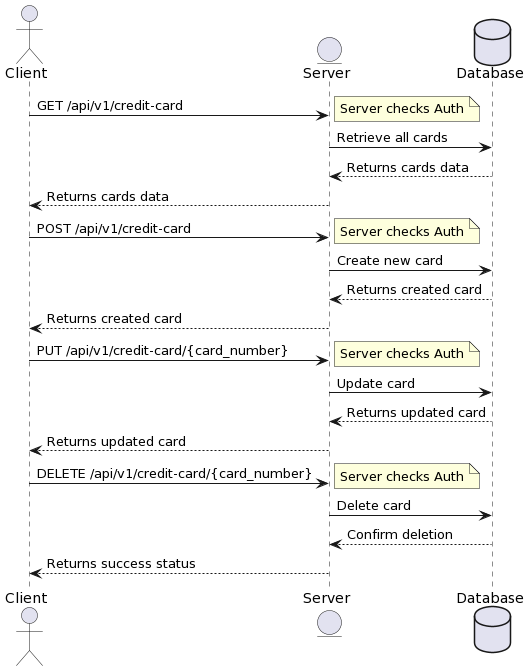

# Card Vault
[](https://app.codacy.com/gh/leonardomarcao/credit_card/dashboard?utm_source=gh&utm_medium=referral&utm_content=&utm_campaign=Badge_grade)
[](https://codecov.io/gh/leonardomarcao/credit_card)


Card Vault is a secure and intuitive credit card management system designed to store, retrieve, update, and delete credit card data. The main goal of this application is to provide a convenient solution for businesses and individuals who need to manage a large amount of credit card data.

<p align="center">
  
</p>

## Setup

### Prerequisites

  - [Python 3.10](https://www.python.org/downloads/release/python-3100/) (if running locally)
  - [Docker](https://docs.docker.com/get-docker/) (if running using Docker)
  - [Docker Compose](https://docs.docker.com/compose/install/) (if running using Docker)
  - [Git](https://git-scm.com/downloads) (for dependencies, like `python-creditcard`)

### Environment Variables ⚠️

  - Create a `.env` file in the root directory of the project based on the `.env.example` file.

## Docker Quickstart

This app can be run completely using Docker` and `docker-compose`. Using Docker is recommended, as it guarantees the application is run using compatible versions of Python.

To run the app using Docker (detached mode), run the following command:

```bash
docker-compose up card-vault-app -d
```


Go to http://localhost:8080 to view the app.

Go to http://localhost:8080/docs to view the API documentation.

## Running locally

Run the following commands to bootstrap your environment if you wish to run the application locally:

```bash
pip install -r requirements
flask db upgrade
flask run
```

Go to http://localhost:8080 to view the app.

Go to http://localhost:8080/docs to view the API documentation.

## Running Tests

To ensure the integrity of the application, you can run a suite of tests that have been written using pytest. Whether you are running the application locally or using Docker, you can use the following commands to run the tests:

### Running tests locally

To run the tests locally, navigate to the root directory of your application and run:

```bash
pytest
```

This will discover and run all the test cases that exist in your tests directory.

### Running tests using Docker

If you are running the application in Docker, you can run the tests using the following command:


```bash
docker-compose run card-vault-app pytest
```

This command creates a new service that runs the pytest command in a new container.

When the tests have completed, you will see a summary in the terminal. If all the tests pass, then everything is working as expected. If any tests fail, you should see error messages that explain what has gone wrong.

## Coverage Report

If you want to generate a coverage report, you can do so with the following commands:

### Running coverage locally

```bash
pytest --cov=card_vault
```

### Running coverage using Docker

```bash

docker-compose run card-vault-app pytest --cov=card_vault
```


### Acknowledgements/Credits

  - [python-creditcard](https://github.com/MaisTodos/python-creditcard): this project was used as a reference for the credit card validation logic.
  - [cookiecutter-flask](https://github.com/cookiecutter-flask/cookiecutter-flask): this project was bootstrapped using the Flask Cookiecutter template. We would like to express our sincere gratitude to the maintainers and contributors of this open-source project for providing a strong starting point for our application.
